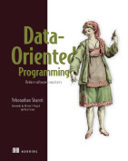

# Data-Oriented Programming

From book :
Data-Oriented Programming: Reduce software complexity
Yehonathan Sharvit

[https://www.manning.com/books/data-oriented-programming](https://www.manning.com/books/data-oriented-programming)

* [Chapter 1 : Complexity of object-oriented programming](chapter_1/README.md)
* [Chapter 2 : Separation between code and data](chapter_2/README.md)
* [Chapter 3 : Basic data manipulation](chapter_3/README.md)
* [Chapter 6 : Unit tests](chapter_6/README.md)

[https://github.com/viebel/data-oriented-programming](https://github.com/viebel/data-oriented-programming)

Data-oriented programming in Java :

* [https://www.infoq.com/articles/data-oriented-programming-java/](https://www.infoq.com/articles/data-oriented-programming-java/)
* [Paris JUG: 2022/09/27 La programmation orienté donnée avec Java 19 https://youtu.be/q9qT8s01elY?si=inV_zMCdiFOUtUqF](https://youtu.be/q9qT8s01elY?si=inV_zMCdiFOUtUqF)
* [Paris JUG: 2022/09/27 La programmation orienté donnée avec Java 19 (suite) https://youtu.be/uFj0_GWvdWs?si=epU0ap1Sfekg0gzQ](https://youtu.be/uFj0_GWvdWs?si=epU0ap1Sfekg0gzQ)
