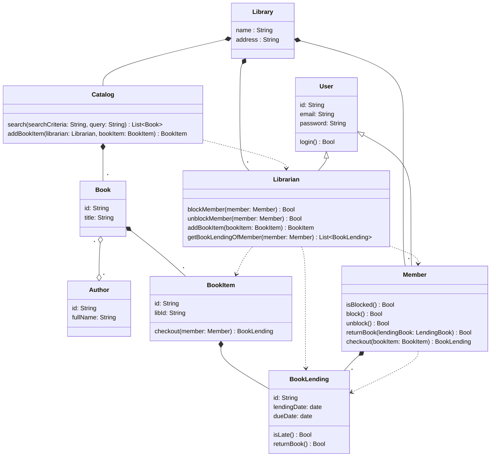
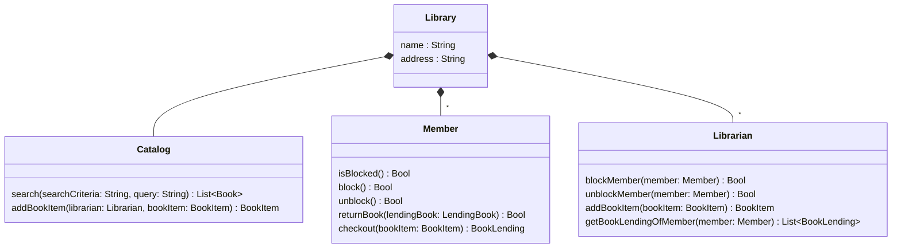
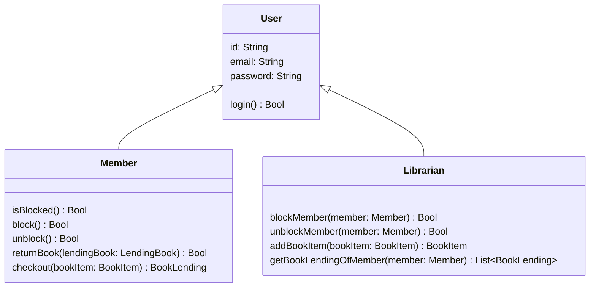
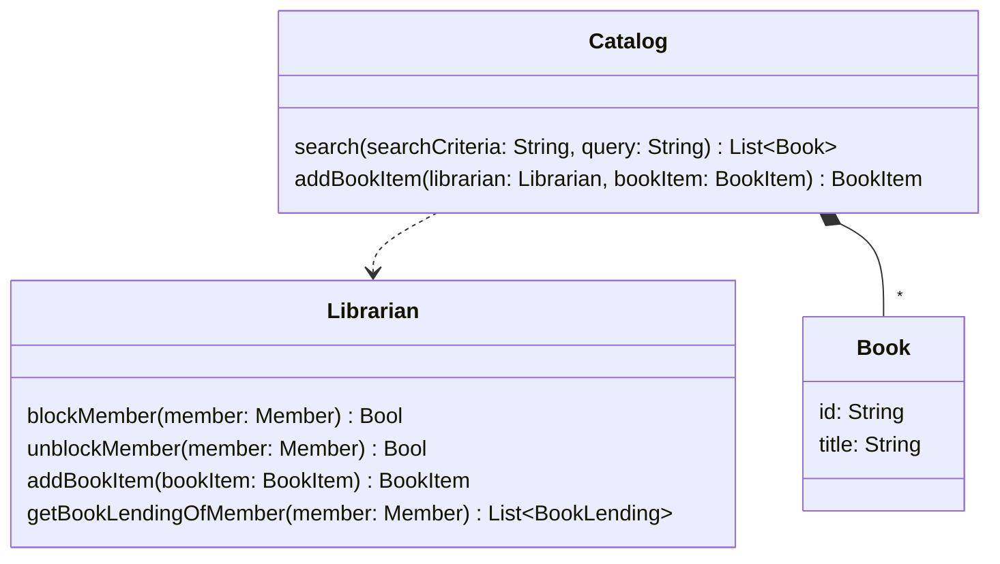
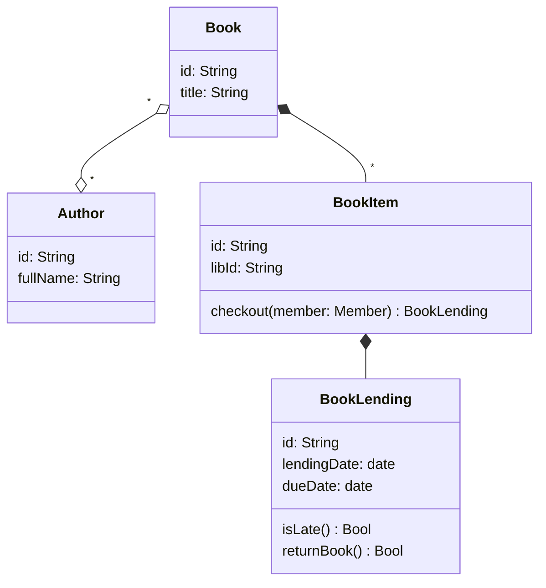
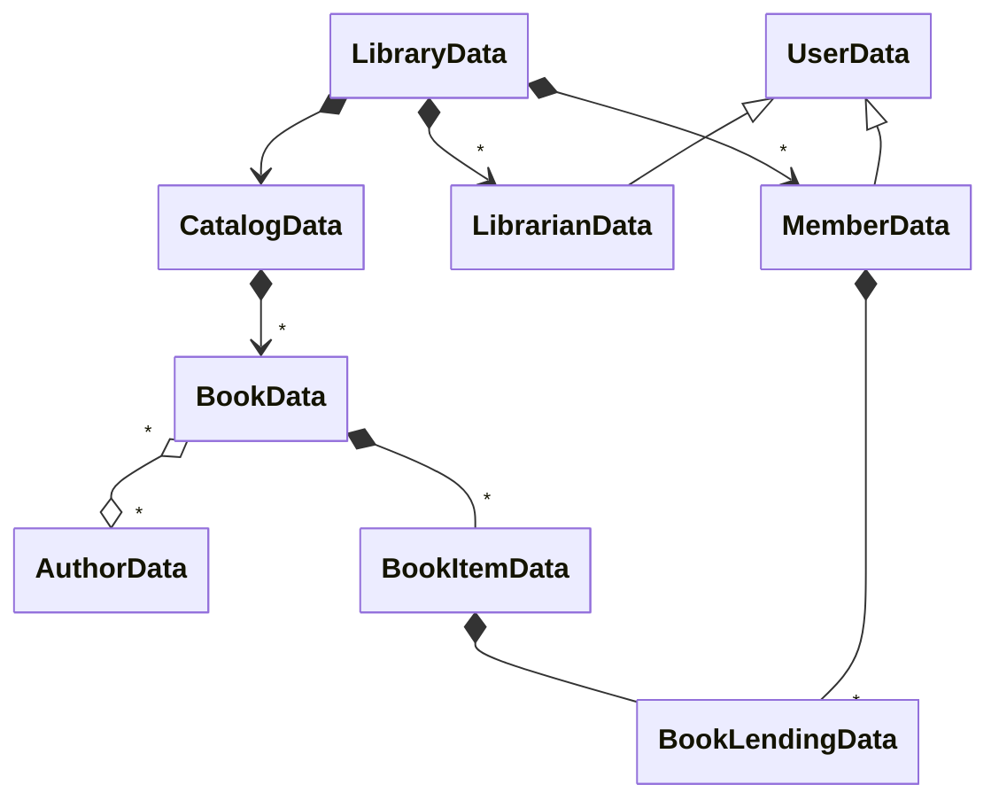
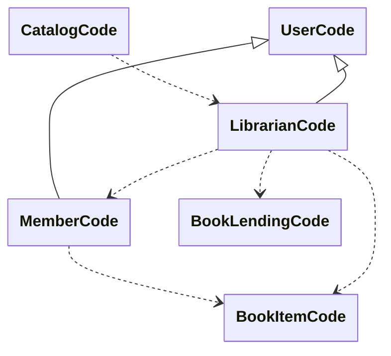

# Chapter 1 : Complexity of object-oriented programming

## The requirements for the Klafim prototype

- Two kinds of users: library members and librarians.
- Users log in to the system via email and password.
- Members can borrow books.
- Members and librarians can search books by title or by author.
- Librarians can block and unblock members (e.g., when they are late in returning a book).
- Librarians can list the books currently lent to a member.
- There can be several copies of a book.
- A book belongs to a physical library.

## The main classes of the library management system

- Library—The central part of the system design.
- Book—A book.
- BookItem—A book can have multiple copies, and each copy is considered as a book item.
- BookLending—When a book is lent, a book lending object is created.
- Member—A member of the library.
- Librarian—A librarian.
- User—A base class for Librarian and Member.
- Catalog—Contains a list of books.
- Author—A book author.

## Klafim's Global Library Management System

## The `Library` class

The `Library` is the root class of the library system.

In terms of code or behavior, a `Library` object does nothing on its own.
It delegates everything to the object its owns.

In terms of data, a `Librarian` object owns :

- Multiple `Member` objects.
- Multiple `Librarian` objects.
- A single `Catalog` object.

## `Lbrarian`, `Member` and `User` classes

`Librarian` and `Member` both derive from `User`.

The `User` class represents a user of the library :

- In terms of data members, it sticks to the bare minimum: it has an `id`, `email`, and `password` (with no security and encryption for now).  
- In terms of code, it can log in via login.

The `Member` class represents a member of the library :

- It inherits from `User`.
- In terms of data members, it has nothing more than `User`.
- In terms of code, it can :

  - Check out a book via `checkout`.
  - Return a book via `returnBook`.
  - Block itself via `block`.
  - Unblock itself via `unblock`.
  - Answer if it is blocked via `isBlocked`.

- It owns multiple `BookLending` objects.
- It uses `BookItem` in order to implement `checkout`.

The `Librarian` class represents a librarian :

- It derives from `User`.
- In terms of data members, it has nothing more than User.
- In terms of code, it can

  - Block and unblock a Member.
  - List the member’s book lendings via `getBookLendings`.
  - Add book items to the library via `addBookItem`.
  
- It uses `Member` to implement `blockMember`, `unblockMember`, and `getBookLendings`.
- It uses `BookItem` to implement `checkout`.
- It uses `BookLending` to implement `getBookLendings.`.

## The `Catalog` class

The `Catalog` class is responsible for the mamagement of the books.

In terms of code, a `Catalog` object can :

- Search books via `search`.
- Add book items to the library via `addBookItem`.

A `Catalog`object uses `Librarian` in order to implement `addBookItem`.

In terms of data, a `Catalog` owns multiple `Book` objects.

## The `Book` class

In terms of data, a `Book` object :

- Should have as its bare minimum an `id` and a `title`.
- Is associated with multiple `Author` objects (a book might have multiple authors).
- Owns multiple `BookItem` objects, one for each copy of the book.

## `BookItem` class

The `BookItem` class represents a book copy, and a book could have many copies.

In terms of data, a `BookItem` object :

- Should have as its bare minimum data for members : an `id` and a `libId` (for its physical library ID).
- Owns multiple `BookLending` objects, one for each time the ook is lent.

In terms of code, a `BookItem` object can be checked out via `checkout`.

- Data relations :
  - `Library` has many `Member`s.
  - `Member` has many `BookLending`s.
- Code relations :
  - `Member` extends `User`.
  - `Librarian` uses `Member`.
  - `Member` use `BookItem`.

Class diagrams where every class is split into code and data entities

