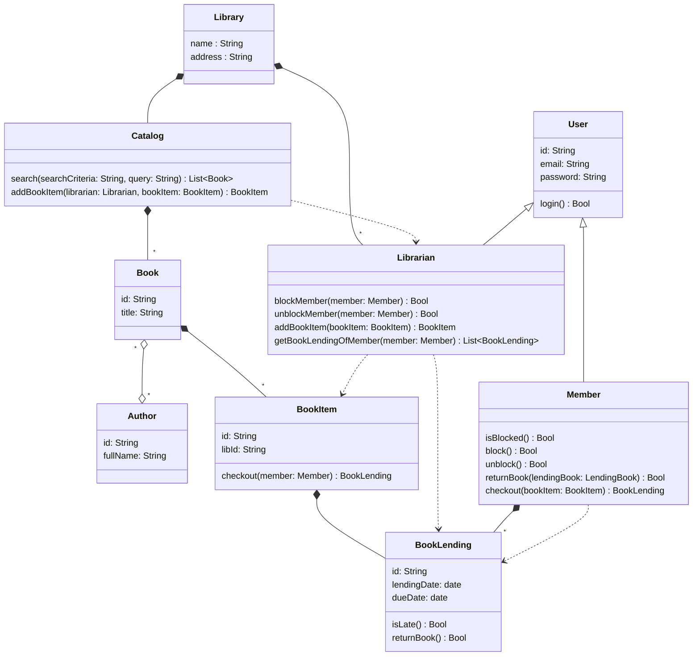
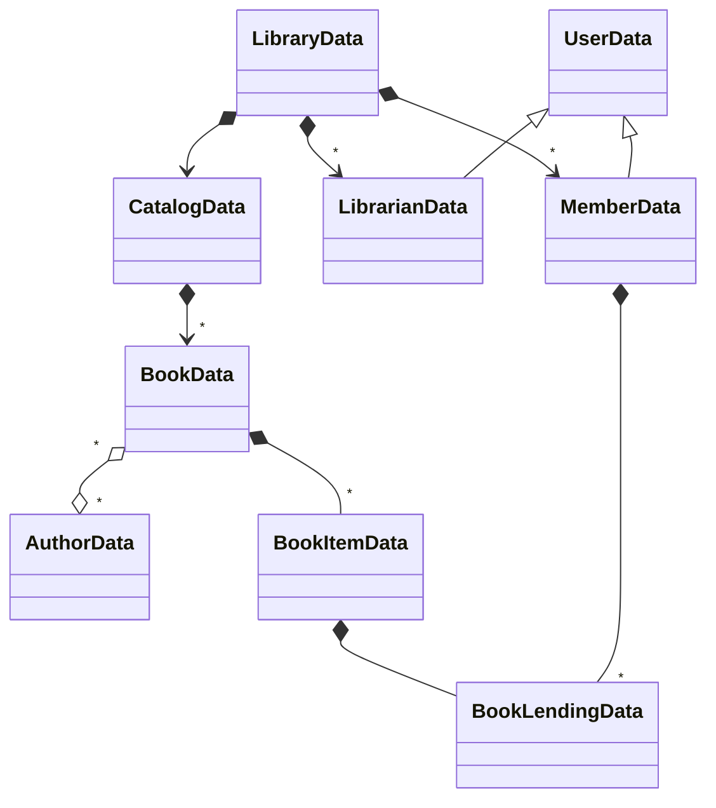
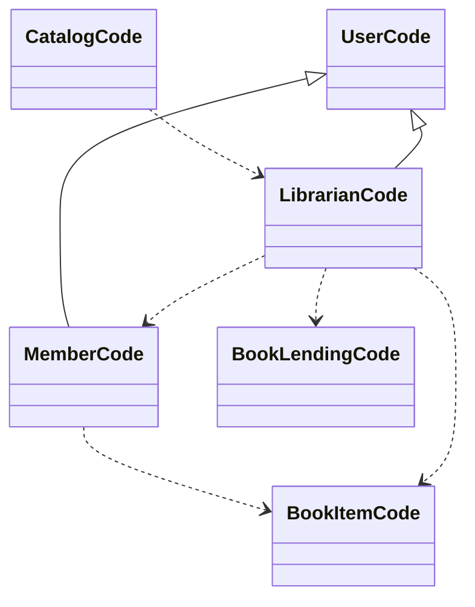

# Chapter 1 : Complexity of object-oriented programming

The requirements for the Klafim prototype

* There are two kinds of users: library members and librarians.
* Users log in to the system via email and password.
* Members can borrow books.
* Members and librarians can search books by title or by author.
* Librarians can block and unblock members (e.g., when they are late in returning a book).
* Librarians can list the books currently lent to a member.
* There can be several copies of a book.
* A book belongs to a physical library.

The main classes of the library management system

* Library—The central part of the system design.
* Book—A book.
* BookItem—A book can have multiple copies, and each copy is considered as a book item.
* BookLending—When a book is lent, a book lending object is created.
* Member—A member of the library.
* Librarian—A librarian.
* User—A base class for Librarian and Member.
* Catalog—Contains a list of books.
* Author—A book author.

A class diagram of Klafim's Global Library Management System

The `Library` is the root class of the library system.

* Data relations :
  * `Library` has many `Member`s.
  * `Member` has many `BookLending`s.
* Code relations :
  * `Member` extends `User`.
  * `Librarian` uses `Member`.
  * `Member` use `BookItem`.

Class diagrams where every class is split into code and data entities

