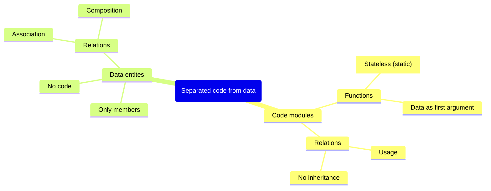
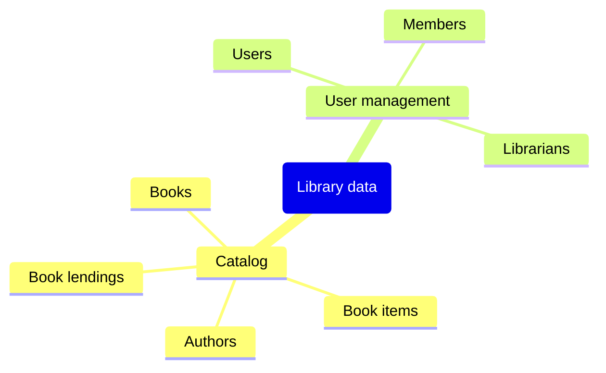
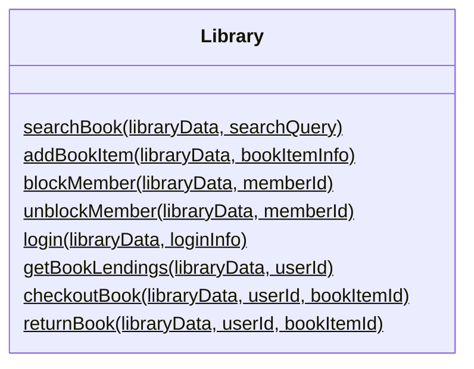
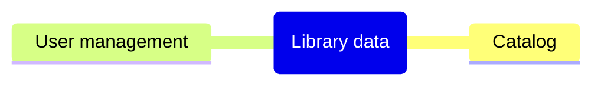
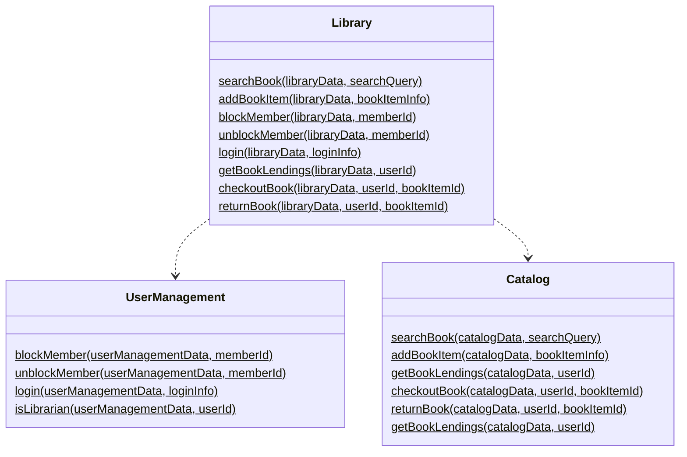

# Chapter 2 : Separation between code and data

DOP principle #1 summarized: Separate code from data

## Data entites

Highlighting terms in the requirements that correspond to data entities

* There are two kinds of users: library _members_ and _librarians_.
* _Users_ log in to the system via email and password.
* _Members_ can borrow _books_.
* _Members_ and _librarians_ can search books by title or by author.
* _Librarians_ can block and unblock _members_ (e.g., when they are late in returning a book).
* _Librarians_ can list the _books_ currently lent to a _member_.
* There could be several copies of a _book_.

The data entities of the system organized in a nested list

* The catalog data
  * Data about books
  * Data about authors
  * Data about book items
  * Data about book lendings
* The user management data
  * Data about users
  * Data about members
  * Data about librarians

A data entities of the system organized in a mind map

## Code modules

Highlighting terms in the requirements that correspond to fontionality

* There are two kinds of users: library members and librarians.
* Users _log in to the system_ via email and password.
* Members can _borrow_ books.
* Members and librarians can _search books_ by title or by author.
* Librarians can _block_ and _unblock members_ (e.g., when they are late in returning a book).
* _Librarians_ can _list the books currently lent to a member_.
* There could be several copies of a _book_.

The functionality of the library system

* Search for a book.
* Add a book item.
* Block a member.
* Unblock a member.
* Log a user into the system.
* List the books currently lent to a member.
* Borrow a book.
* Return a book.
* Check whether a user is a librarian.

The Library module with the functions’ arguments

A mind map of the high-level data entities of the Library Management System

 The modules of the Library Management System

