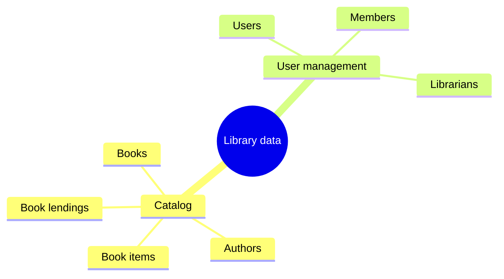
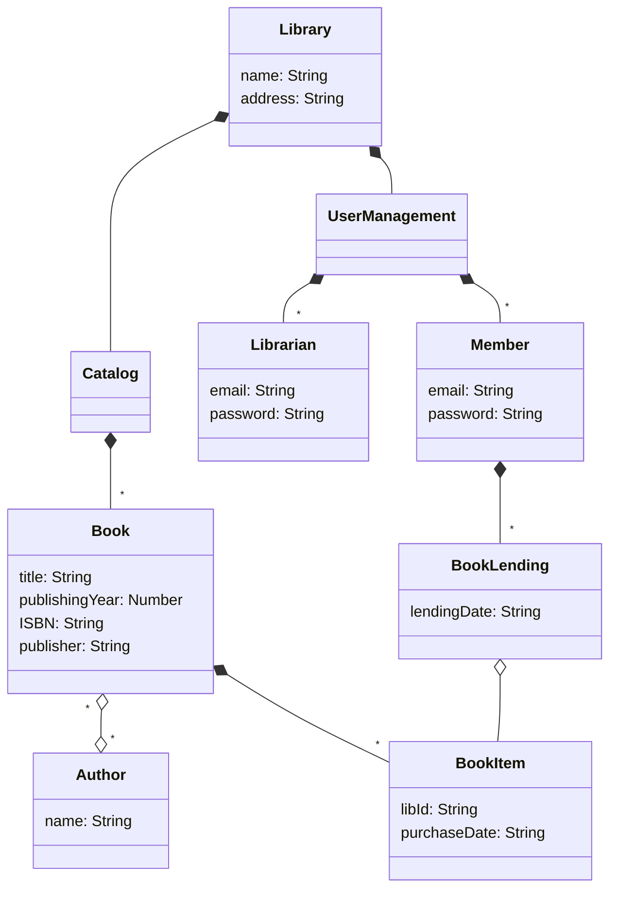
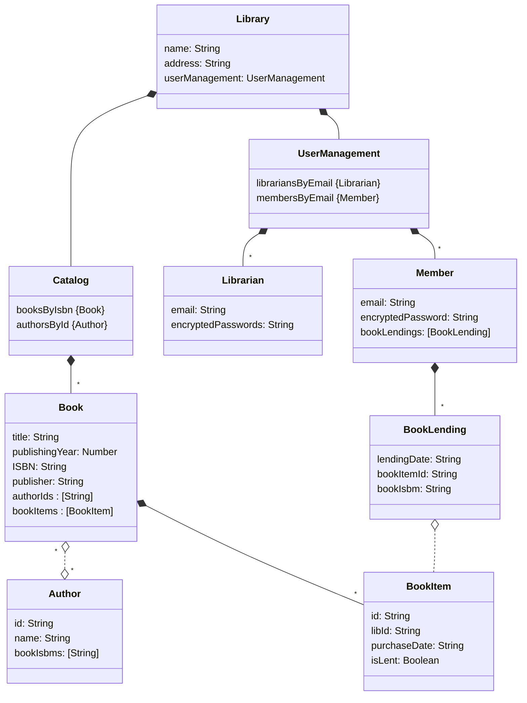

# Chapter 3 : Basic data manipulation

## Design a data model

A data mind map of the Library Management System

A data model of the Library Management System

Library management relation model. Dashed lines (e.g., between Book and Author) denote indirect relations, [String] denotes a positional collection of strings, and {Book} denotes an index of Books.

