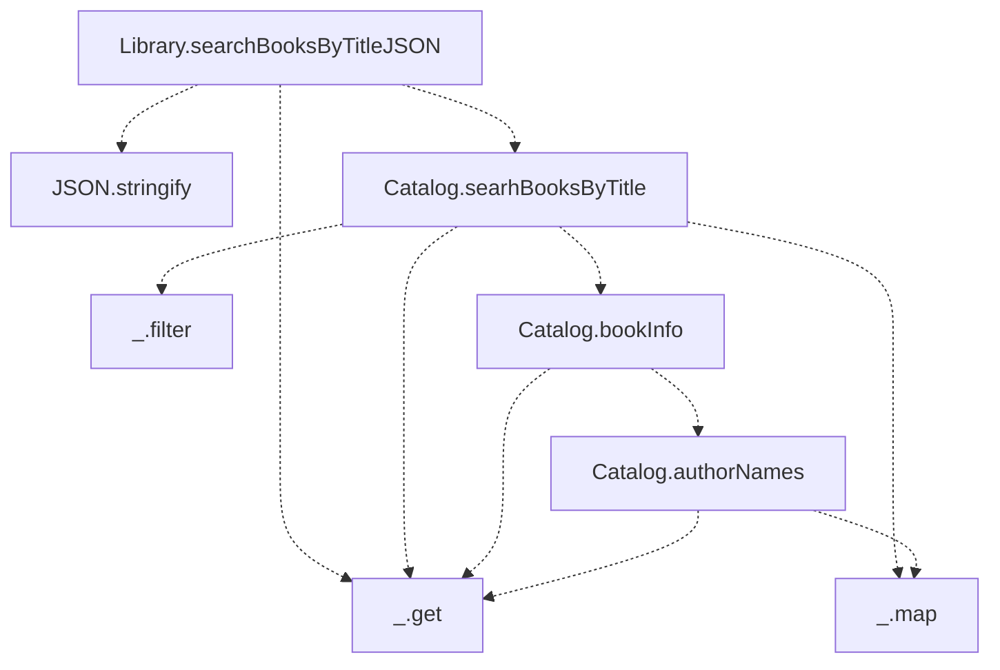

# Chapter 6 : Unit tests

The steps of the test case

1. Generate data input: `dataIn`
2. Generate expected output: `dataOut`
3. Compare the output of the function with the expected output `f(dataIn)` and `dataOut`

The tree of function calls for the search query code flow

