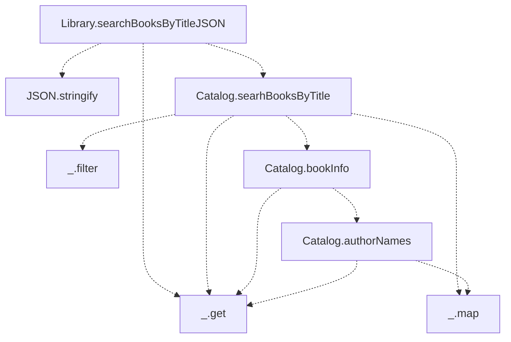
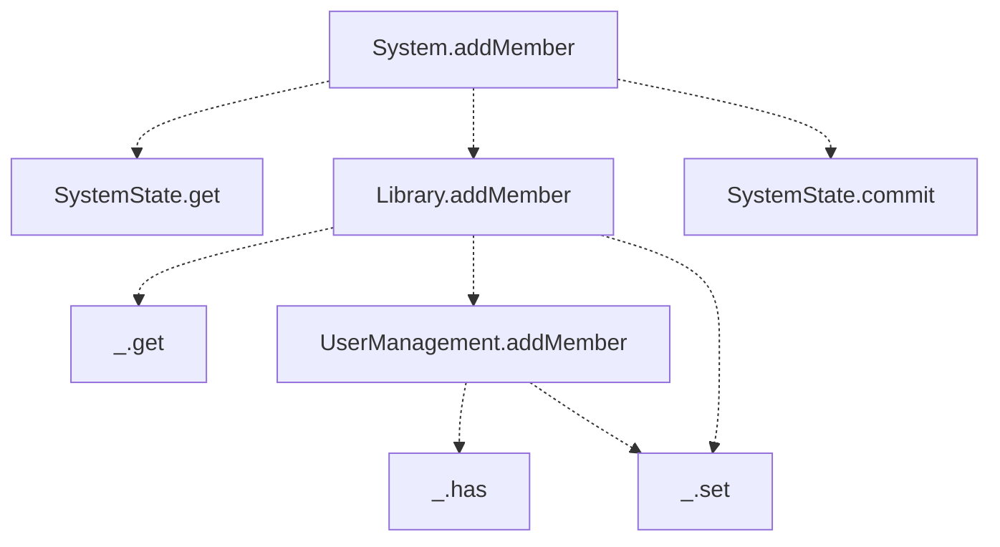

# Chapter 6 : Unit tests

The steps of the test case

1. Generate minumal data input: `dataIn`.
2. Generate expected output: `dataOut`.
3. Compare the output of the function with the expected output `f(dataIn)` and `dataOut`.

> Most of the code in a data-oriented system deals with data manipulation.
>
> A tree of function calls for a function `f` is a tree where the root is `f`, and the children of a node `g` in the tree are the functions called by `g`. The leaves of the tree are functions that are not part of the code base of the application. These are functions the don't call any other functions.
>
> The validity of the data depends of the context.
>
> The smaller the data, the easier it is to manipulate.

The tree of function calls for the search query code flow

The tree of functions calls for system add member

